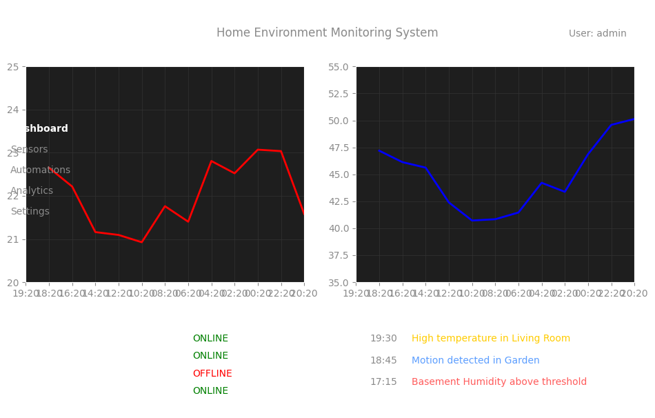

<div align="center">
  
  <h1>SmartSense</h1>
  <p><strong>A sophisticated IoT environmental monitoring and automation platform</strong></p>
  <p>
    <a href="https://github.com/aaronjacobs-chelt/SmartSense/actions"></a>
    <a href="https://opensource.org/licenses/MIT"></a>
    <a href="https://www.python.org/downloads/"></a>
    <a href="https://aaronjacobs-chelt.github.io/SmartSense/"></a>
  </p>
</div>

## 📋 Table of Contents
- [Overview](#-overview)
- [Features](#-features)
- [Quick Start](#-quick-start)
- [Installation](#-installation)
- [Usage Example](#-usage-example)
- [Documentation](#-documentation)
- [Project Structure](#-project-structure)
- [Development Setup](#-development-setup)
- [Contributing](#-contributing)
- [License](#-license)

## 🌐 Overview

**SmartSense** is a cutting-edge IoT environmental monitoring and automation platform designed for modern distributed sensor networks. It combines real-time data collection, sophisticated analysis algorithms, and intuitive visualization tools to deliver actionable insights from your environment.

Whether you're monitoring a smart home, an agricultural deployment, or an industrial facility, SmartSense provides a flexible and powerful solution that scales from single-device setups to large distributed networks.

## 🚀 Features

- **Modern Architecture** — Scalable, containerized design with event-driven components
- **Real-time Monitoring** — Low-latency data acquisition with sub-second response times
- **Extensible Sensor Framework** — Plug-and-play support for hundreds of sensor types
- **Advanced Visualization** — Interactive dashboards powered by D3.js and Plotly
- **Comprehensive REST API** — Well-documented OpenAPI-compliant endpoints
- **Intelligent Alerting** — Highly configurable alert conditions and actions
- **Machine Learning Integration** — Anomaly detection and predictive maintenance
- **Cross-platform Support** — Runs on Linux, macOS, Windows, and various SBCs (Raspberry Pi, etc.)

<div align="center">
  <p><em>Dashboard Preview</em></p>
  <!-- Add a dashboard preview image when available -->
  
</div>

## 🚦 Quick Start

Get up and running with SmartSense in minutes:

```bash
# Install SmartSense
pip install smartsense

# Create a simple monitoring script
cat > monitor.py << EOF
from smartsense import SensorNetwork
from smartsense.sensors.base import TemperatureSensor, HumiditySensor

# Create a sensor network
network = SensorNetwork(name="Home Environment")

# Add sensors (virtual sensors for this example)
network.add_sensor(TemperatureSensor(name="Living Room Temperature"))
network.add_sensor(HumiditySensor(name="Living Room Humidity"))

# Start monitoring
network.running = True

# Poll the sensors a few times
for _ in range(5):
    for sensor_id, sensor in network.sensors.items():
        reading = sensor.read_sync()
        if reading:
            print(f"{sensor.name}: {reading}")
    
    # Wait before next reading
    import time
    time.sleep(2)
EOF

# Run the script
python monitor.py
```

## 🔧 Installation

SmartSense requires Python 3.9+ and can be installed via pip:

### Standard Installation

```bash
pip install smartsense
```

### Development Installation

```bash
git clone https://github.com/aaronjacobs-chelt/SmartSense.git
cd SmartSense
pip install -e ".[dev]"
```

For complete installation instructions, including platform-specific setup for hardware sensors, see our [Getting Started Guide](docs/getting_started.md).

## 💻 Usage Example

Here's a more detailed example showing how to create a sensor network with alerts:

```python
from smartsense import SensorNetwork
from smartsense.sensors.base import TemperatureSensor, HumiditySensor

# Create a sensor network
network = SensorNetwork(name="Home Environment")

# Add temperature sensor
temp_sensor = TemperatureSensor(
    name="Living Room Temperature",
    update_interval=2.0,
    min_value=18.0,
    max_value=26.0,
)
network.add_sensor(temp_sensor)

# Add humidity sensor
humid_sensor = HumiditySensor(
    name="Living Room Humidity",
    update_interval=3.0,
    min_value=30.0,
    max_value=60.0,
)
network.add_sensor(humid_sensor)

# Define alert actions
def temperature_alert():
    print("🔥 Temperature threshold exceeded! Activating cooling system...")
    # Code to activate cooling would go here
    
def humidity_alert():
    print("💧 Humidity threshold exceeded! Activating dehumidifier...")
    # Code to activate dehumidifier would go here

# Configure alerts
network.add_alert(
    sensor_id=temp_sensor.id,
    field="temperature",
    operator="gt",                    # greater than
    value=25.0,                       # 25°C threshold
    actions=[("activate_cooling", temperature_alert)],
    alert_name="High Temperature Alert",
)

network.add_alert(
    sensor_id=humid_sensor.id,
    field="humidity",
    operator="gt",                    # greater than
    value=55.0,                       # 55% threshold
    actions=[("activate_dehumidifier", humidity_alert)],
    alert_name="High Humidity Alert",
)

# Start the network
network.running = True

# In a real application, you would implement an event loop here
# For a complete implementation, see examples/demo.py
```

For more examples, check out the [examples directory](examples/).

## 📚 Documentation

Comprehensive documentation is available at [aaronjacobs-chelt.github.io/SmartSense](https://aaronjacobs-chelt.github.io/SmartSense/).

Key documentation pages:

- [Getting Started](docs/getting_started.md) - Installation and first steps
- [Architecture Overview](docs/architecture.md) - System design and components
- [Hardware Requirements](docs/hardware_requirements.md) - Supported devices and setup
- [API Reference](docs/api_reference.md) - Detailed code documentation
- [Sensor Configuration](docs/sensor_configuration.md) - Setting up various sensors
- [Dashboard Setup](docs/dashboard_setup.md) - Visualizing your data
- [Alert System](docs/alerts.md) - Configuring automated responses

## 📂 Project Structure

```
SmartSense/
├── docs/               # Documentation
│   ├── images/         # Documentation images
│   ├── architecture.md # Architecture overview
│   └── ...             # Other documentation files
├── examples/           # Example scripts
│   └── demo.py         # Comprehensive demo
├── src/                # Source code
│   └── smartsense/     # Main package
│       ├── api/        # REST API implementation
│       ├── core/       # Core monitoring system
│       ├── sensors/    # Sensor implementations
│       └── utils/      # Utility functions
├── tests/              # Test suite
├── .github/            # GitHub configuration
├── CONTRIBUTING.md     # Contribution guidelines
├── LICENSE             # MIT License
└── README.md           # This file
```

## 🔬 Development Setup

Follow these steps to set up a development environment:

```bash
# Clone the repository
git clone https://github.com/aaronjacobs-chelt/SmartSense.git

# Navigate to the directory
cd SmartSense

# Create a virtual environment
python -m venv venv
source venv/bin/activate  # On Windows: venv\Scripts\activate

# Install development dependencies
pip install -e ".[dev]"

# Install pre-commit hooks
pre-commit install

# Run tests
pytest
```

## 🤝 Contributing

Contributions are welcome and appreciated! Here's how you can help:

1. **Report bugs**: Create a detailed issue with steps to reproduce
2. **Suggest features**: Open an issue to discuss your idea
3. **Submit pull requests**: Fork the repository and create a pull request with your changes

Before contributing, please read our [Contributing Guidelines](CONTRIBUTING.md) for code style, development practices, and submission process.

### Contributing Workflow

1. Fork the repository
2. Create a feature branch (`git checkout -b feature/amazing-feature`)
3. Make your changes
4. Run tests (`pytest`)
5. Commit your changes (`git commit -m 'Add amazing feature'`)
6. Push to the branch (`git push origin feature/amazing-feature`)
7. Open a Pull Request

## 📄 License

SmartSense is licensed under the MIT License - see the [LICENSE](LICENSE) file for details.

---

<div align="center">
  <p>Made with ❤️ by <a href="https://github.com/aaronjacobs-chelt">Aaron Jacobs</a></p>
  <p>
    <a href="https://github.com/aaronjacobs-chelt/SmartSense/issues">Report Bug</a> •
    <a href="https://github.com/aaronjacobs-chelt/SmartSense/issues">Request Feature</a>
  </p>
</div>
